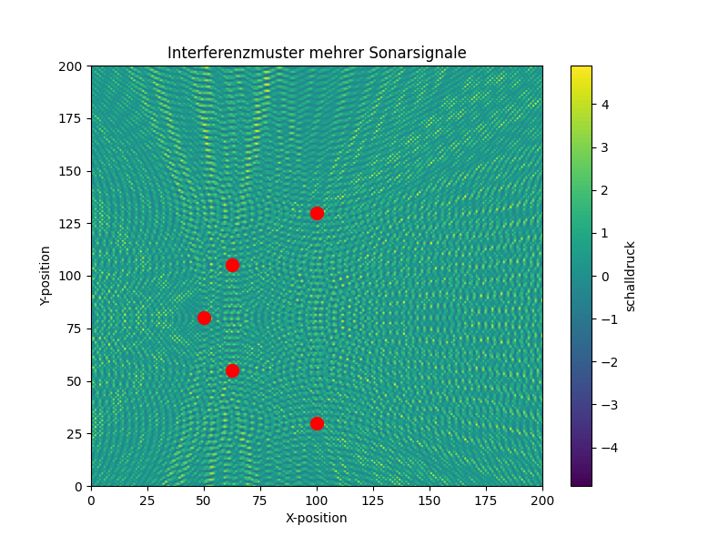
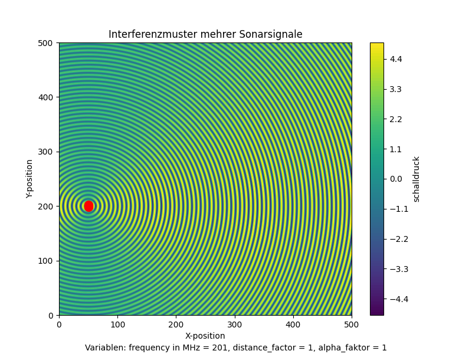
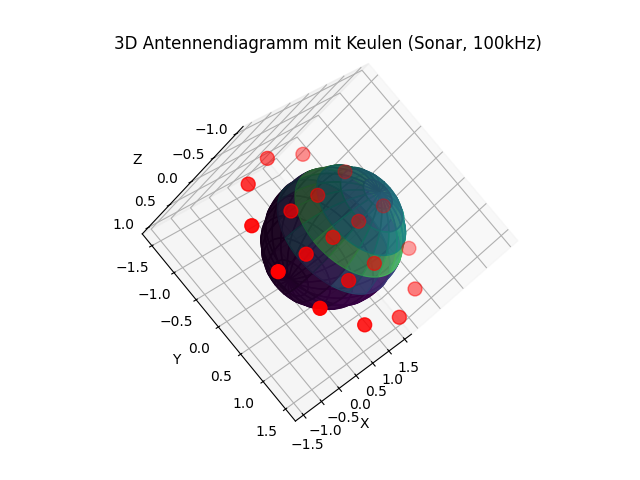
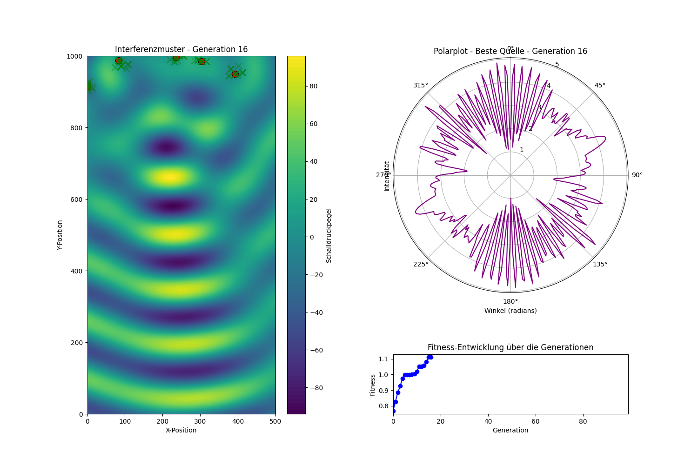

# Sonar Simulation  

Simulation für Sonar-Arrays zur Analyse verschiedener Anordnungen und Szenarien.  

## Inhalt  
- [Überblick](#überblick)  
- [Funktionen](#funktionen)  
- [Installation](#installation)  
- [Verwendung](#verwendung)  
- [Simulationen](#simulationen)  
- [Voraussetzungen](#voraussetzungen)  
- [Lizenz](#lizenz)  

## Überblick  
Dieses Projekt simuliert unterschiedliche Anordnungen von Sonar-Arrays, um akustische Muster zu analysieren und darzustellen.  

## Funktionen  
- Parabelförmige Anordnung  
- Parabelförmig mit mehreren Quellen  
- Lineare Anordnung mit mehreren Quellen  
- 3D-hexagonale Anordnung  
- Lineare Analyse  
- ML-basierte Vollanalyse  

## Installation  
1. Repository klonen:  
    ```bash
    git clone https://github.com/Reariuz/sonar-simulation.git
    cd sonar-simulation
    ```
2. Benötigte Abhängigkeiten installieren:  
    ```bash
    pip install -r requirements.txt
    ```  

## Verwendung  
Starte eine Simulation mit:  
```bash
python simulation-001_Sonar-Parabelförmig.py
```  

## Simulationen  
### 1. Parabelförmige Anordnung  
`simulation-001_Sonar-Parabelförmig.py`  
_Beschreibung der Simulation_  
  

### 2. Parabelförmig mit mehreren Quellen  
`simulation-002_Sonar-Parabelförmig-multiple.py`  
_Beschreibung der Simulation_  
  
 

### 3. Lineare Anordnung mit mehreren Quellen  
`simulation-003_Sonar-Linear-multiple.py`  
_Beschreibung der Simulation_  
.png)  
.png)  

### 4. 3D-hexagonale Anordnung  
`simulation-004_Sonar-3D-hexagonal.py`  
_Beschreibung der Simulation_  
  

### 5. Lineare Analyse  
`simulation-011_Sonar-Linar-Analysis.py`  
_Beschreibung der Simulation_  

### 6. ML-basierte Vollanalyse  
`simulation13_ML-Full.py`  
_Beschreibung der Simulation_  
  

## Voraussetzungen  
- Python 3.x  
- Abhängigkeiten in `requirements.txt`  

## Lizenz  
Dieses Projekt ist unter der GPL-3.0 Lizenz lizenziert. Siehe [LICENSE](LICENSE) für Details.  

---

**Hinweis:** Ersetze die Platzhalter für die Bilder (`path/to/image-*.png`) durch die tatsächlichen Pfade, sobald die Bilder verfügbar sind.  

Wenn du weitere Anpassungen möchtest, sag einfach Bescheid!
